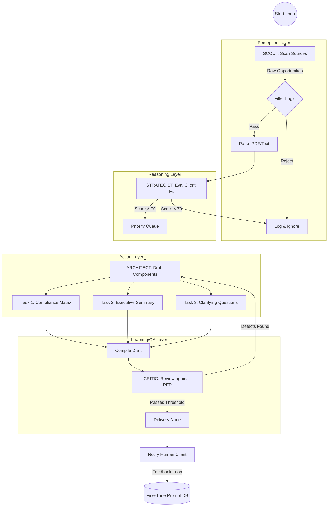

<active_task_status>
**Current Phase:** PERCEIVE & REASON
**Goal:** Analyze 3 digital income models -> Select One -> Generate Agentic Execution Graph.
**Constraint Check:** No internal Amazon portals. Mobile-compatible. Structured output.
**Buffer Status:** Time Blindness mitigation active (15-min buffers included in workflow estimates).
</active_task_status>

<thinking>
I will analyze three models based on "Low Overhead" (Low CAPEX/OPEX) and "High Leverage" (Code/AI > Human Labor).

1.  **AI-Driven RFP/Grant Response Service:** High friction to start, but massive value per unit.
2.  **Autonomous Newsletter Aggregator (Curated Intelligence):** Low friction, slow ramp, asset-based.
3.  **Programmatic SEO Remediation (Content Refresh Agent):** High utility, strictly B2B, recurring revenue potential.

*Selection Logic:* The **AI-Driven RFP/Grant Response Service** offers the highest immediate cash flow potential per successful loop. It solves a painful, high-stakes problem (writing proposals is tedious and expensive). By constraining the scope to a "First-Pass Architect," we minimize hallucination risk while maximizing time-value for clients.
</thinking>

### Part 1: Analysis of 3 Low-Overhead Digital Income Models

#### Model A: The "First-Pass" RFP Proposal Architect
*   **Concept:** An agentic workflow that monitors government/freelance portals (Upwork, SAM.gov) for requests for proposals (RFPs). It digests the requirements and auto-generates a Compliance Matrix and an Executive Summary Draft.
*   **Overhead:** Low (API costs for LLMs + Scraping).
*   **Revenue:** Productized Service ($500–$2,000/month retainer per client for "unlimited first drafts").
*   **Viability Score:** 8.5/10 (High demand, medium technical complexity).

#### Model B: The Programmatic SEO "Reviver"
*   **Concept:** An agent connecting to a client's Google Search Console. It identifies pages that dropped in rank, scrapes the current top 3 competitors, and rewrites the client's content to fill semantic gaps/update statistics.
*   **Overhead:** Low (Hosting + APIs).
*   **Revenue:** Performance-based (Paid per recovered click) or Flat Fee.
*   **Viability Score:** 7/10 (High dependency on Google algorithms).

#### Model C: The Hyper-Local Lead Qualifier (Voice/SMS)
*   **Concept:** An AI Voice/SMS agent that calls/texts raw leads (e.g., from Facebook Ads) for home service businesses (plumbers, roofers) to qualify budget and timeline before booking an appointment.
*   **Overhead:** Medium (Telephony APIs like Twilio/Vapi).
*   **Revenue:** Pay Per Qualified Appointment ($50–$150).
*   **Viability Score:** 6/10 (High regulation risk/TCPA compliance).

---

### Part 2: Selected Niche & Strategy
**Chosen Model:** **Model A: The "First-Pass" RFP Proposal Architect**

**Why:** It offers the cleanest "Agentic" workflow. The input (RFP PDF) is structured, and the output (Draft) is text-based. It eliminates the "Blank Page Syndrome" for human agencies, a service they will gladly pay for to save 4–6 hours per proposal.

---

### Part 3: The Agentic Execution Graph

This graph maps the workflow from data ingestion to cash-flow realization. It uses a **Manager-Worker** topology.

#### **Core Agents Defined:**
1.  **SCOUT (Ingestion):** Monitors feeds, filters noise.
2.  **STRATEGIST (Decision):** "Go/No-Go" logic based on client criteria.
3.  **ARCHITECT (Production):** Generates the artifacts.
4.  **CRITIC (Quality Assurance):** Grades output against the RFP requirements.

#### **The Execution Loop (Mermaid Visualization)**

---

### Part 4: Technical Breakdown & Automation Steps

#### 1. Ingestion (The SCOUT)
*   **Tools:** Python (BeautifulSoup/Selenium) or Apify Actors.
*   **Trigger:** Daily run at 06:00 AM (local time).
*   **Logic:**
    *   Scrape target URLs (Upwork RSS, Gov portals).
    *   *Constraint:* Must ignore opportunities < $5k budget to ensure ROI.

#### 2. Reasoning (The STRATEGIST)
*   **Tools:** OpenAI GPT-4o or Claude 3.5 Sonnet (via API).
*   **Prompt Logic:**
    *   *Input:* Client Portfolio + New RFP Text.
    *   *Task:* "Rate this opportunity 0-100 based on technical match. If < 70, explain why and stop."
    *   *Output:* JSON object `{ "decision": "GO", "score": 85, "rationale": "..." }`.

#### 3. Execution (The ARCHITECT)
*   **Tools:** LangChain or AutoGen.
*   **Sub-Tasks:**
    *   **Compliance Matrix:** Extract every sentence containing "shall," "must," or "will" and map it to a spreadsheet row.
    *   **Exec Summary:** Write a "Ghost Draft" using the client's past successful proposals as style references (RAG - Retrieval Augmented Generation).

#### 4. Review (The CRITIC)
*   **Tools:** A separate LLM instance (Context separation prevents bias).
*   **Logic:** "You are a procurement officer. Reject this draft if it fails to answer Section C.4 specifically."
*   **Self-Healing:** If rejected, the Critic sends specific error logs back to the Architect for a rewrite (Max 2 retries to save API costs).

### Part 5: Implementation Roadmap (First 48 Hours)

<actionable_plan>
**Phase 1: Foundation (Hours 0-12)**
1.  **Set up AirTable:** Create the database for `Opportunities`, `Clients`, and `Drafts`.
2.  **Configure Zapier/Make:** Connect RSS/Email trigger to OpenAI API.
3.  **Prompt Engineering:** Build the "Strategist" prompt. Test it on 10 past RFPs to verify it correctly identifies "wins."

**Phase 2: The MVP (Hours 12-24)**
1.  **Manual-Hybrid Loop:**
    *   Script the retrieval.
    *   Manually review the "Strategist" scores.
    *   Auto-generate the draft only on manual approval (Human-in-the-Loop).
2.  **Buffer Check:** Insert a 15-minute "Cool Down" block after every 3 hours of coding to prevent cognitive tunnel vision.

**Phase 3: Client Acquisition (Hours 24-48)**
1.  **The Hook:** Do not sell "AI." Sell "I will send you a pre-filled Compliance Matrix for every relevant RFP by 8 AM daily."
2.  **Outreach:** Find 5 boutique dev agencies. Offer a free 1-week pilot.
</actionable_plan>